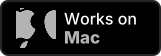

# Nuru Clock

(Not the clock that Neuro actually uses, that's way more basic.)

Note: This project was made more as a way of putting my understanding of the Neuro Game API into a different language than just TypeScript. Hence why it's basic and also redundant.

[Image credits](./image-credits.md)

## Features

- Gets the current time in any timezone.
- Gets the current time in Unix.

<!--[See the documentation](../docs/) for more.-->

## Running the program

Pre-built binaries are in the Actions tab.

If you're running from source, you'll need to run the `main.py` file after installing dependencies in `requirements.txt`. The `lab.py` is for experimenting with stuff, so it won't work/be relevant 99.99% of the time.
